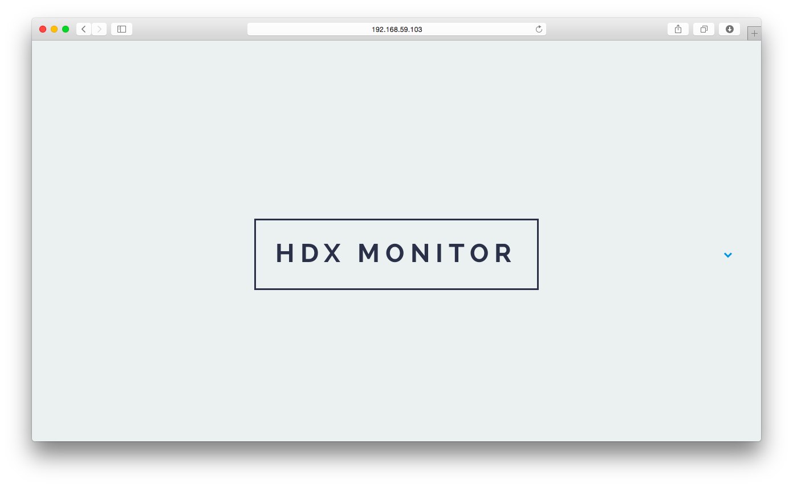

## HDX Monitor
Repository with the `docker-compose.yml` instructions that correcly set-up the whole HDX Monitor application.

## Environment Variables
* `DEFAULT_API_KEY`: Will be used as the default API key for registering datastores on CKAN.
* `MONGODB_USER_NAME`, `MONGODB_USER_PASSWORD`, and `MONGODB_DATABASE`: MongoDB configuration.

You will also need Google authorization files (`*.p12`) placed in a folder called `/secrets`. That folder should be mounted to the `funnel-stats` container.
